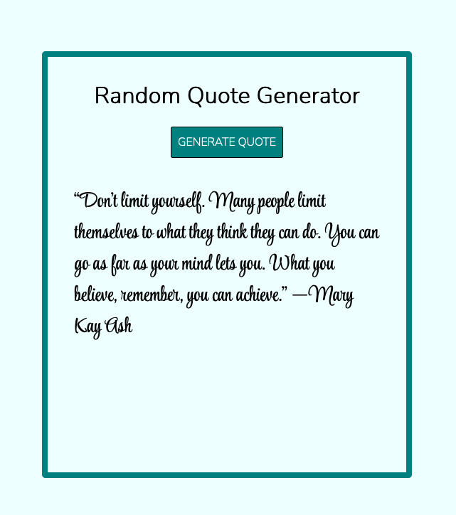

# Random Quotes Project with JavaScript

JavaScript Project | Generate a random quote

## Table of Contents

- [Random Quotes Project with JavaScript](#random-quotes-project-with-javascript)
  - [Table of Contents](#table-of-contents)
  - [General Information](#general-information)
  - [Screenshot](#screenshot)
  - [Technologies](#technologies)
  - [Site Link](#site-link)
  - [What I Learned](#what-i-learned)
  - [Author](#author)

## General Information

This is Project #3 from [100+ JavaScript Projects for Beginners!](https://jsbeginners.com/javascript-projects-for-beginners/)
The project objectives are to create a button that generates a random quote when clicked.

## Screenshot

## Technologies

- HTML
- CSS
- JavaScript

## Site Link

>**Live Site: [Generate Random Quote](https://vlorozco.github.io/random-quote/)**

## What I Learned

This project was fun to develop, it strengthened my skills in html, css and javascript. It has helped strengthen my JavaScript skills in utilizing the `Math.random()` and `Math.floor()` methods to randomize a variable containing an array of quotes.

## Author

- Github - [Veronica L. Orozco](https://github.com/VLOrozco)
- Frontend Mentor - [@VLOrozco](https://www.frontendmentor.io/profile/VLOrozco)
- Codecademy - [orozcov3](https://www.codecademy.com/profiles/orozcoV3)
